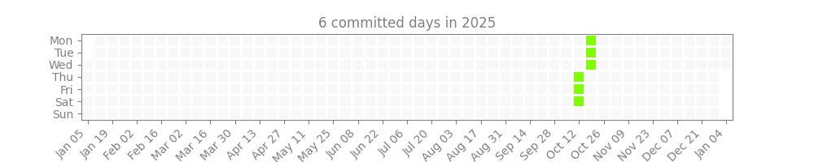

# daily_challenge — GitHub-hosted pre-commit hook

A lightweight pre-commit hook that regenerates a yearly activity heatmap from a repository's Git commit history and stages the generated PNG. This repo is intended to be referenced directly from other projects using `pre-commit` (no PyPI publication required).

Why use it
- Quickly visualize contributor activity for the year.
- Keep a generated image in your repo (e.g. embedded in README) without having to run the generator manually.

Example output (committed to your repo):



## Install & Configure in Your Repository

1. Install and enable `pre-commit` in the target repository:

```bash
pip install pre-commit
pre-commit install
```

2. Add the following to your target repo's `.pre-commit-config.yaml` (in the root of the target repo):

```yaml
repos:
  - repo: https://github.com/ScottChiuNYC/daily_challenge
    rev: v0.1.1  # pin to a release or SHA for stability
    hooks:
      - id: daily-challenge
        name: daily challenge
        entry: python -c "from daily_challenge import main; main()"
        language: python
        additional_dependencies: ['matplotlib', 'numpy']
```

3. Recommended: Add the following image link to your repository's `README.md` so the generated heatmap will be displayed:

```md

```

## Behavior

- The hook regenerates `yearly_heatmaps/2025.png` and stages it with `git add` so it will be included in the running commit.
- It seems the displayed image won't update sometimes due to cache. Solution is for the generator to update `README.md` with a cache-busting `?ts=` query parameter (so GitHub/CDN will fetch the new image), not implemented yet. 

## Contributing

PRs welcome — especially for improving the hook manifest, docs, tests, or making the behavior configurable.

