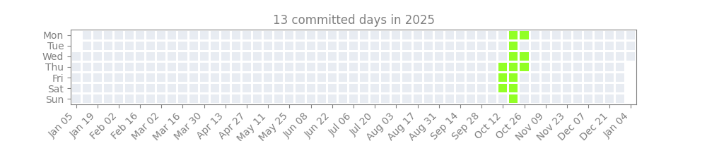

# The `daily-challenge` Pre-Commit Hook

This repository provides a pre-commit hook that regenerates a yearly activity heatmap (`yearly_heatmaps/2025.png`) from Git commit history and stages the generated image. Below is an example of the generated image: 



A pre-commit hook is a program that, once installed in a git repo, runs automatically every time before you commit anything. This project is distributed as a GitHub-hosted pre-commit hook, not uploaded to PyPI. 


## How To Set Up This Hook in Your Repo

1. In your repo's root directory, run
```bash
pip install pre-commit
pre-commit install
```
2. Also in your repo's root directory, create a `.pre-commit-config.yaml` file and add the following to it: 
```yaml
repos:
  - repo: https://github.com/ScottChiuNYC/daily_challenge
    rev: v0.1.1
    hooks:
    - id: daily-challenge
      name: daily challenge
      entry: python -c "from daily_challenge import main; main()"
      language: python
      description: "Generate the 2025 yearly heatmap and stage the generated image."
      additional_dependencies: ['matplotlib', 'numpy']
```
3. Optional but recommended: Add the following image link to your repository's `README.md` so the generated heatmap will be displayed: 
```md

```

## Contributing

PRs welcome — especially for improving the hook manifest, docs, and tests.

